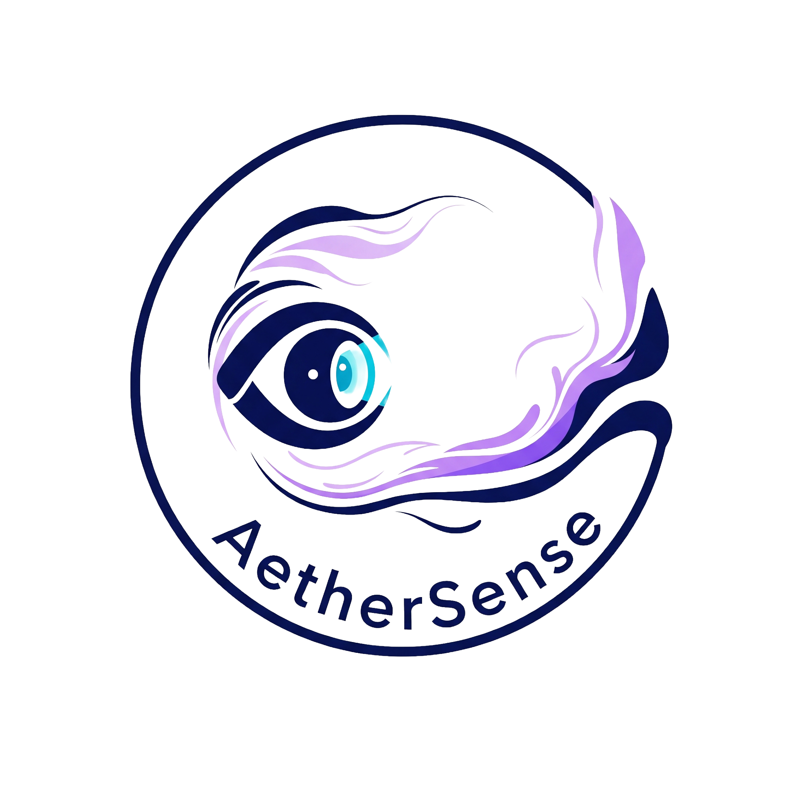

# AetherSense

<div align="center">

[](https://discord.gg/nnkfW83n)
&nbsp;


</div>

AetherSense Core is a consent-based, offline-friendly C++20 signal-processing runtime for presence/motion detection from **pre-extracted** CSI-like complex streams.

## Safety boundary
- This project does **not** include CSI extraction, driver patches, kernel modules, firmware changes, or packet injection.
- Inputs are file-based/mock streams only.

## Phase 2 pipeline
1. Ingest `CsiFrame` samples (CSV/JSONL).
2. Aggregate a fixed window of frames.
3. Build subcarrier time-series; select top-K by variance.
4. Phase processing per selected subcarrier: `atan2` -> unwrap -> detrend.
5. Smooth (EMA or median).
6. Apply Hann/Hamming window and FFT.
7. Integrate band energy (motion 0.5-5.0Hz, optional breathing 0.1-0.5Hz).
8. Hysteresis decision (`threshold_on`, `threshold_off`, `hold_frames`).

## Build / test
```bash
cmake -S . -B build
cmake --build build -j4
ctest --test-dir build --output-on-failure
```

## Run
```bash
./build/apps/aethersense_cli --config ./testdata/sample_config.json
./build/apps/aethersense_cli --config ./testdata/sample_config.json --dry-run
./build/apps/aethersense_cli --config ./testdata/sample_config.json --export-decisions ./decisions.csv
./build/apps/aethersense_cli --print-config-schema
./build/apps/aethersense_cli --version
```

## Config v2 example
See `testdata/sample_config.json`.

## CI
- Linux/macOS build+test matrix.
- Sanitizer job (ASAN/UBSAN).
- clang-format and clang-tidy checks.

## Limitations
- Designed for deterministic lab demos and reproducible file-driven evaluation.
- No hardware acquisition code in this repository.
